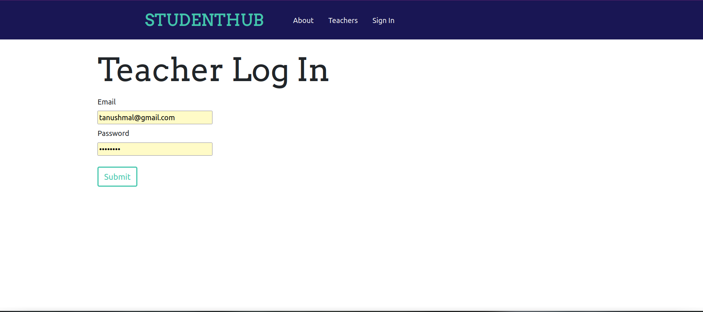
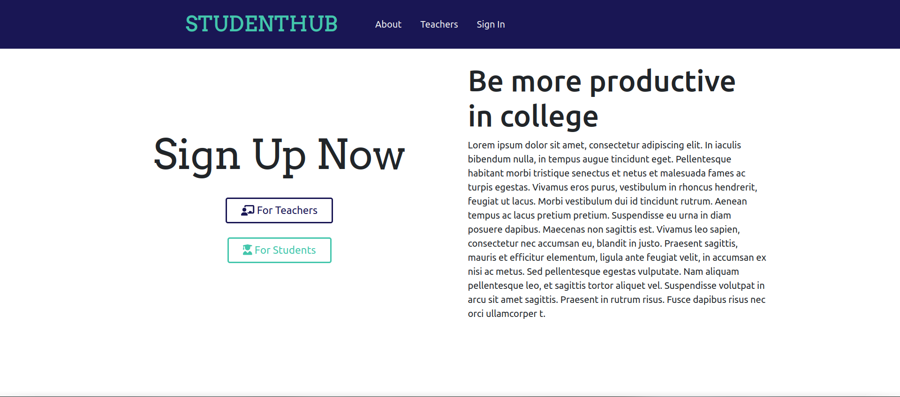
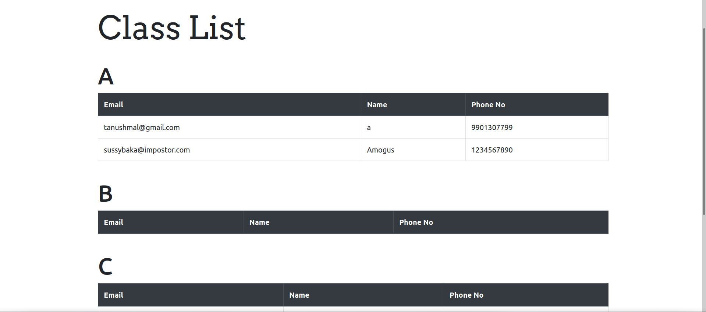

# Student Hub
Student Hub is a website which helps students connect woth teachers better. Teachers can post notes as raw text or a pdf, and students can view the posts and save them. Teachers can also manage all their students within the website.

## Website View
 
 
 

## Technologies Used
<ol>
  <li>React : Front-End Framework</li>
  <ul>
    <li> React Router DOM : Multi-page routing</li>
    <li> Axios : API calls </li>
  </ul>
  <li>Flask : Server-Side Framework</li>
  <li>FontAwesome Icons</li>
</ol>

## Languages
<ul>
   <li>JavaScript</li>
   <li>Python</li>
   <li>HTML/CSS</li>
</ul>

Made as Mini-Project for DBMS and Web Development(College 5th SEM)
